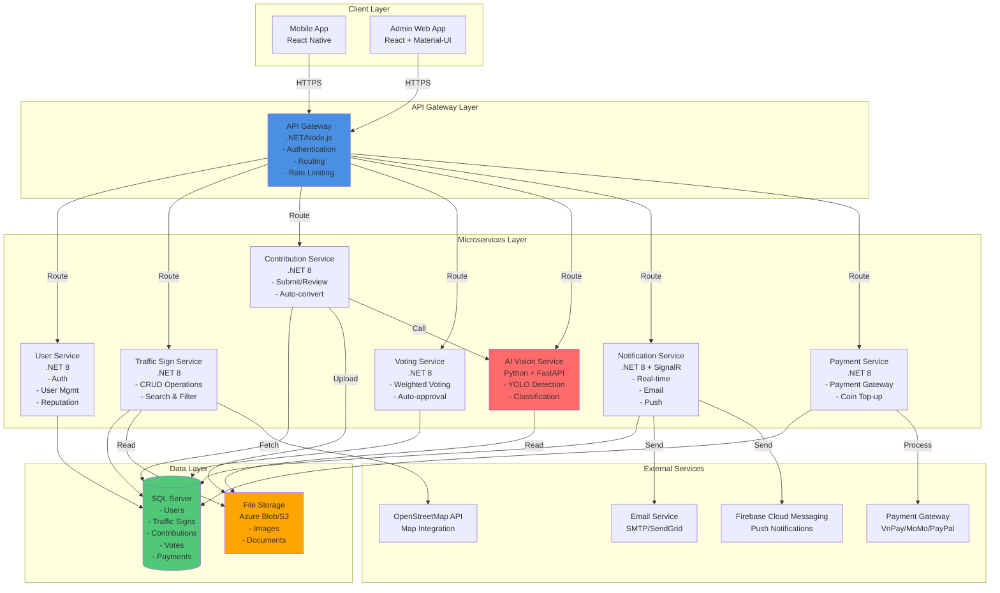

# System Architecture Diagram - SignMap

## Tổng quan kiến trúc hệ thống

## Chi tiết các thành phần

### API Gateway
- **Chức năng:** Entry point duy nhất, xử lý authentication, routing, rate limiting
- **Công nghệ:** .NET 8 hoặc Node.js/Express

### Microservices
- **User Service:** Quản lý users, authentication, reputation system
- **Traffic Sign Service:** CRUD operations, search với coin charging
- **Contribution Service:** Submit contributions, admin review, auto-convert to TrafficSign
- **Voting Service:** Weighted voting algorithm, auto-approval/rejection
- **AI Vision Service:** YOLO-based detection và classification
- **Notification Service:** Real-time notifications (SignalR), email, push
- **Payment Service:** Payment gateway integration, coin wallet management

### Data Layer
- **SQL Server:** Primary database cho tất cả entities
- **File Storage:** Azure Blob Storage hoặc AWS S3 cho images

### External Services
- **OpenStreetMap:** Map integration và display
- **Email Service:** SMTP hoặc SendGrid
- **FCM:** Push notifications cho mobile
- **Payment Gateway:** VnPay, MoMo, PayPal

