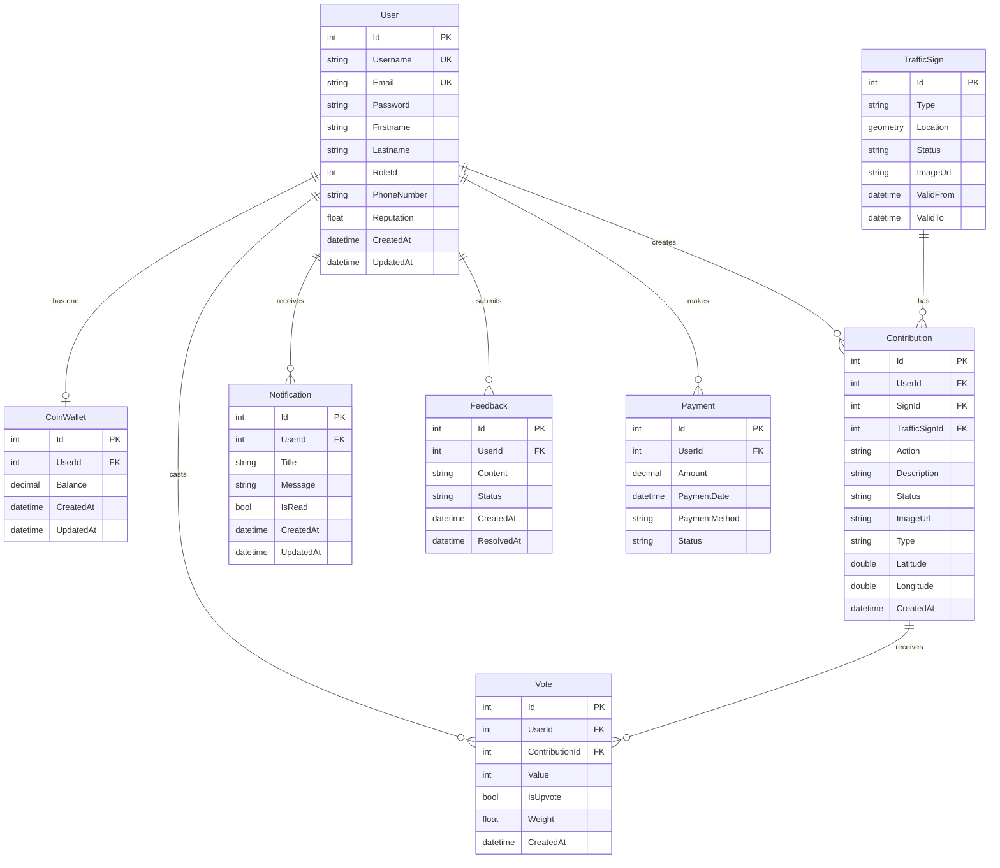

# Database ERD - SignMap

## Entity Relationship Diagram

## Mối quan hệ chi tiết

### User Relationships
- **1:1 với CoinWallet:** Mỗi user có một wallet
- **1:N với Contribution:** User có thể tạo nhiều contributions
- **1:N với Vote:** User có thể vote nhiều contributions
- **1:N với Notification:** User nhận nhiều notifications
- **1:N với Feedback:** User có thể submit nhiều feedbacks
- **1:N với Payment:** User có thể thực hiện nhiều payments

### Contribution Relationships
- **N:1 với User:** Mỗi contribution thuộc về một user
- **N:1 với TrafficSign:** Contribution có thể reference một TrafficSign (cho Update/Delete actions)
- **1:N với Vote:** Mỗi contribution nhận nhiều votes

### Constraints
- **Unique:** Username, Email trong User
- **Unique:** UserId trong CoinWallet (1:1 relationship)
- **Unique:** (ContributionId, UserId) trong Vote (một user chỉ vote một lần cho mỗi contribution)

## Indexes
- User.Username (Unique)
- User.Email (Unique)
- CoinWallet.UserId (Unique)
- Vote(ContributionId, UserId) (Unique)

