# Component Diagram - SignMap

## Component Architecture và Dependencies

```mermaid
graph TB
    subgraph "Client Applications"
        MA[Mobile App<br/>React Native]
        WEB[Admin Web App<br/>React]
    end

    subgraph "API Gateway"
        GW[API Gateway<br/>Middleware]
        AUTH[Auth Middleware<br/>JWT Validation]
        RATE[Rate Limiter]
        CACHE[Cache Layer]
    end

    subgraph "User Service"
        UC[User Controller]
        US[User Service]
        UM[User Mapper]
        UR[User Repository]
    end

    subgraph "Traffic Sign Service"
        TSC[Traffic Sign Controller]
        TSS[Traffic Sign Service]
        TSM[Traffic Sign Mapper]
        TSR[Traffic Sign Repository]
    end

    subgraph "Contribution Service"
        CC[Contribution Controller]
        CS[Contribution Service]
        CM[Contribution Mapper]
        CR[Contribution Repository]
        CWS[Coin Wallet Service<br/>Dependency]
        TSS2[Traffic Sign Service<br/>Dependency]
        NS2[Notification Service<br/>Dependency]
    end

    subgraph "Voting Service"
        VC[Vote Controller]
        VS[Vote Service]
        VM[Vote Mapper]
        VR[Vote Repository]
        US2[User Service<br/>Dependency<br/>Reputation]
    end

    subgraph "AI Vision Service"
        AIC[AI Controller]
        AIS[AI Service]
        YOLO[YOLO Model<br/>Detection & Classification]
    end

    subgraph "Notification Service"
        NC[Notification Controller]
        NS3[Notification Service]
        HUB[SignalR Hub<br/>Real-time]
        ES[Email Service]
        FCM[FCM Service]
    end

    subgraph "Payment Service"
        PC[Payment Controller]
        PS2[Payment Service]
        PM[Payment Mapper]
        PR[Payment Repository]
        CWS2[Coin Wallet Service<br/>Dependency]
        PG[Payment Gateway<br/>Adapter]
    end

    subgraph "Data Access"
        DB[(SQL Server<br/>Entity Framework)]
    end

    subgraph "External"
        STORAGE[File Storage]
        OSM[OpenStreetMap]
    end

    MA --> GW
    WEB --> GW
    GW --> AUTH
    GW --> RATE
    GW --> CACHE

    GW --> UC
    GW --> TSC
    GW --> CC
    GW --> VC
    GW --> AIC
    GW --> NC
    GW --> PC

    UC --> US
    US --> UM
    US --> UR
    UR --> DB

    TSC --> TSS
    TSS --> TSM
    TSS --> TSR
    TSR --> DB
    TSS --> OSM

    CC --> CS
    CS --> CM
    CS --> CR
    CR --> DB
    CS --> CWS
    CS --> TSS2
    CS --> NS2
    CS --> AIS
    CS --> STORAGE

    VC --> VS
    VS --> VM
    VS --> VR
    VR --> DB
    VS --> US2

    AIC --> AIS
    AIS --> YOLO
    AIS --> STORAGE

    NC --> NS3
    NS3 --> HUB
    NS3 --> ES
    NS3 --> FCM
    NS3 --> DB

    PC --> PS2
    PS2 --> PM
    PS2 --> PR
    PR --> DB
    PS2 --> CWS2
    PS2 --> PG

    style GW fill:#4A90E2
    style AI fill:#FF6B6B
    style DB fill:#50C878
    style HUB fill:#9B59B6
```

## Component Responsibilities

### API Gateway Components
- **Auth Middleware:** JWT token validation, role-based access
- **Rate Limiter:** Prevent abuse, limit requests per user/IP
- **Cache Layer:** Cache static data, improve performance

### Service Components Pattern
Mỗi service follow pattern:
- **Controller:** HTTP request handling, input validation
- **Service:** Business logic
- **Mapper:** Entity ↔ DTO conversion
- **Repository:** Data access (thông qua Entity Framework)

### Cross-Service Dependencies
- **Contribution Service** depends on:
  - CoinWalletService (deduct coins)
  - TrafficSignService (create/update signs)
  - NotificationService (notify users)
  - AI Vision Service (detect signs)
  
- **Voting Service** depends on:
  - UserService (calculate reputation, expertise)
  
- **Payment Service** depends on:
  - CoinWalletService (credit coins)

