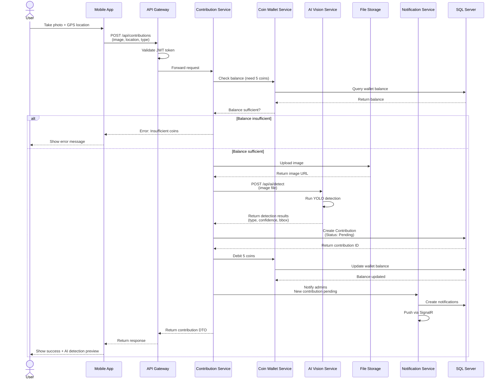
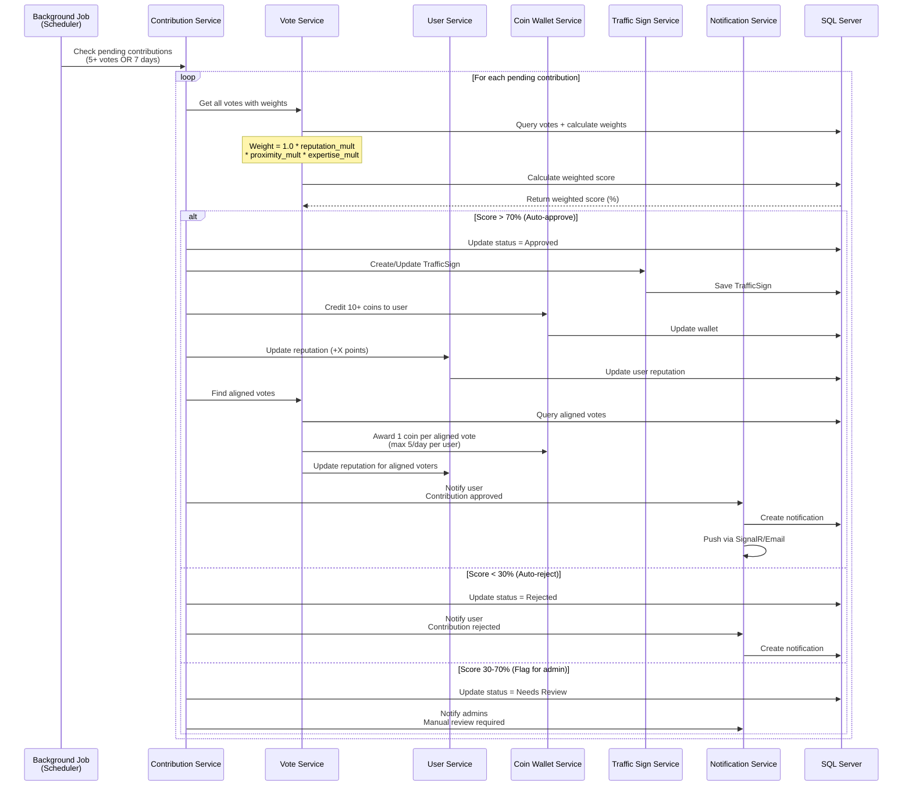

# Sequence Diagram - Submit Contribution Flow

## Flow: User submits a new traffic sign contribution

```mermaid
sequenceDiagram
    actor User
    participant MobileApp as Mobile App
    participant Gateway as API Gateway
    participant ContrService as Contribution Service
    participant WalletService as Coin Wallet Service
    participant AIService as AI Vision Service
    participant Storage as File Storage
    participant NotificationService as Notification Service
    participant Database as SQL Server

    User->>MobileApp: Take photo + GPS location
    MobileApp->>Gateway: POST /api/contributions<br/>(image, location, type)
    
    Gateway->>Gateway: Validate JWT token
    Gateway->>ContrService: Forward request
    
    ContrService->>WalletService: Check balance (need 5 coins)
    WalletService->>Database: Query wallet balance
    Database-->>WalletService: Return balance
    WalletService-->>ContrService: Balance sufficient?
    
    alt Balance insufficient
        ContrService-->>MobileApp: Error: Insufficient coins
        MobileApp-->>User: Show error message
    else Balance sufficient
        ContrService->>Storage: Upload image
        Storage-->>ContrService: Return image URL
        
        ContrService->>AIService: POST /api/ai/detect<br/>(image file)
        AIService->>AIService: Run YOLO detection
        AIService-->>ContrService: Return detection results<br/>(type, confidence, bbox)
        
        ContrService->>Database: Create Contribution<br/>(Status: Pending)
        Database-->>ContrService: Return contribution ID
        
        ContrService->>WalletService: Debit 5 coins
        WalletService->>Database: Update wallet balance
        Database-->>WalletService: Balance updated
        
        ContrService->>NotificationService: Notify admins<br/>New contribution pending
        NotificationService->>Database: Create notifications
        NotificationService->>NotificationService: Push via SignalR
        
        ContrService-->>Gateway: Return contribution DTO
        Gateway-->>MobileApp: Return response
        MobileApp-->>User: Show success + AI detection preview
    end
```

## Flow: Auto-approval after voting (weighted voting)

```mermaid
sequenceDiagram
    participant BackgroundJob as Background Job<br/>(Scheduler)
    participant ContrService as Contribution Service
    participant VoteService as Vote Service
    participant UserService as User Service
    participant WalletService as Coin Wallet Service
    participant TrafficSignService as Traffic Sign Service
    participant NotificationService as Notification Service
    participant Database as SQL Server

    BackgroundJob->>ContrService: Check pending contributions<br/>(5+ votes OR 7 days)
    
    loop For each pending contribution
        ContrService->>VoteService: Get all votes with weights
        VoteService->>Database: Query votes + calculate weights
        Note over VoteService: Weight = 1.0 * reputation_mult<br/>* proximity_mult * expertise_mult
        VoteService->>Database: Calculate weighted score
        Database-->>VoteService: Return weighted score (%)
        
        alt Score > 70% (Auto-approve)
            ContrService->>Database: Update status = Approved
            ContrService->>TrafficSignService: Create/Update TrafficSign
            TrafficSignService->>Database: Save TrafficSign
            ContrService->>WalletService: Credit 10+ coins to user
            WalletService->>Database: Update wallet
            
            ContrService->>UserService: Update reputation (+X points)
            UserService->>Database: Update user reputation
            
            ContrService->>VoteService: Find aligned votes
            VoteService->>Database: Query aligned votes
            VoteService->>WalletService: Award 1 coin per aligned vote<br/>(max 5/day per user)
            VoteService->>UserService: Update reputation for aligned voters
            
            ContrService->>NotificationService: Notify user<br/>Contribution approved
            NotificationService->>Database: Create notification
            NotificationService->>NotificationService: Push via SignalR/Email
            
        else Score < 30% (Auto-reject)
            ContrService->>Database: Update status = Rejected
            ContrService->>NotificationService: Notify user<br/>Contribution rejected
            NotificationService->>Database: Create notification
            
        else Score 30-70% (Flag for admin)
            ContrService->>Database: Update status = Needs Review
            ContrService->>NotificationService: Notify admins<br/>Manual review required
        end
    end
```

