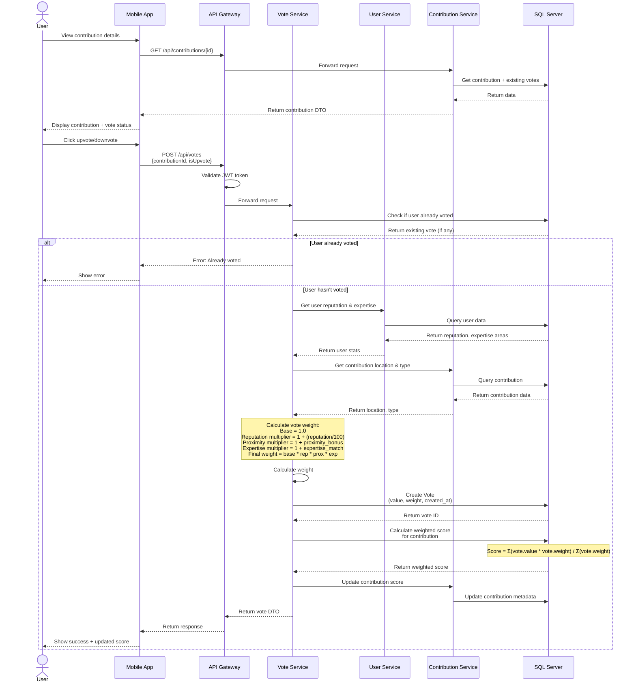
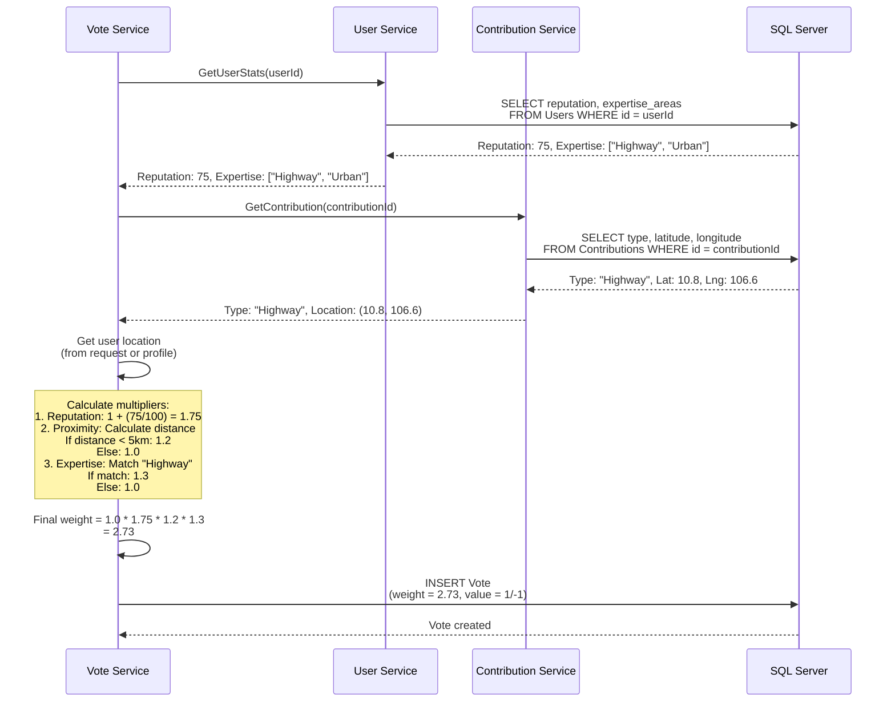

# Sequence Diagram - Voting Flow with Weighted Algorithm

## Flow: User votes on a contribution

```mermaid
sequenceDiagram
    actor User
    participant MobileApp as Mobile App
    participant Gateway as API Gateway
    participant VoteService as Vote Service
    participant UserService as User Service
    participant ContrService as Contribution Service
    participant Database as SQL Server

    User->>MobileApp: View contribution details
    MobileApp->>Gateway: GET /api/contributions/{id}
    Gateway->>ContrService: Forward request
    ContrService->>Database: Get contribution + existing votes
    Database-->>ContrService: Return data
    ContrService-->>MobileApp: Return contribution DTO
    MobileApp-->>User: Display contribution + vote status

    User->>MobileApp: Click upvote/downvote
    MobileApp->>Gateway: POST /api/votes<br/>{contributionId, isUpvote}
    
    Gateway->>Gateway: Validate JWT token
    Gateway->>VoteService: Forward request
    
    VoteService->>Database: Check if user already voted
    Database-->>VoteService: Return existing vote (if any)
    
    alt User already voted
        VoteService-->>MobileApp: Error: Already voted
        MobileApp-->>User: Show error
    else User hasn't voted
        VoteService->>UserService: Get user reputation & expertise
        UserService->>Database: Query user data
        Database-->>UserService: Return reputation, expertise areas
        UserService-->>VoteService: Return user stats
        
        VoteService->>ContrService: Get contribution location & type
        ContrService->>Database: Query contribution
        Database-->>ContrService: Return contribution data
        ContrService-->>VoteService: Return location, type
        
        Note over VoteService: Calculate vote weight:<br/>Base = 1.0<br/>Reputation multiplier = 1 + (reputation/100)<br/>Proximity multiplier = 1 + proximity_bonus<br/>Expertise multiplier = 1 + expertise_match<br/>Final weight = base * rep * prox * exp
        
        VoteService->>VoteService: Calculate weight
        
        VoteService->>Database: Create Vote<br/>(value, weight, created_at)
        Database-->>VoteService: Return vote ID
        
        VoteService->>Database: Calculate weighted score<br/>for contribution
        Note over Database: Score = Σ(vote.value * vote.weight) / Σ(vote.weight)
        Database-->>VoteService: Return weighted score
        
        VoteService->>ContrService: Update contribution score
        ContrService->>Database: Update contribution metadata
        
        VoteService-->>Gateway: Return vote DTO
        Gateway-->>MobileApp: Return response
        MobileApp-->>User: Show success + updated score
    end
```

## Flow: Weight calculation details

```mermaid
sequenceDiagram
    participant VoteService as Vote Service
    participant UserService as User Service
    participant ContrService as Contribution Service
    participant Database as SQL Server

    VoteService->>UserService: GetUserStats(userId)
    UserService->>Database: SELECT reputation, expertise_areas<br/>FROM Users WHERE id = userId
    Database-->>UserService: Reputation: 75, Expertise: ["Highway", "Urban"]
    UserService-->>VoteService: Reputation: 75, Expertise: ["Highway", "Urban"]
    
    VoteService->>ContrService: GetContribution(contributionId)
    ContrService->>Database: SELECT type, latitude, longitude<br/>FROM Contributions WHERE id = contributionId
    Database-->>ContrService: Type: "Highway", Lat: 10.8, Lng: 106.6
    ContrService-->>VoteService: Type: "Highway", Location: (10.8, 106.6)
    
    VoteService->>VoteService: Get user location<br/>(from request or profile)
    
    Note over VoteService: Calculate multipliers:<br/>1. Reputation: 1 + (75/100) = 1.75<br/>2. Proximity: Calculate distance<br/>   If distance < 5km: 1.2<br/>   Else: 1.0<br/>3. Expertise: Match "Highway"<br/>   If match: 1.3<br/>   Else: 1.0
    
    VoteService->>VoteService: Final weight = 1.0 * 1.75 * 1.2 * 1.3<br/>= 2.73
    
    VoteService->>Database: INSERT Vote<br/>(weight = 2.73, value = 1/-1)
    Database-->>VoteService: Vote created
```

