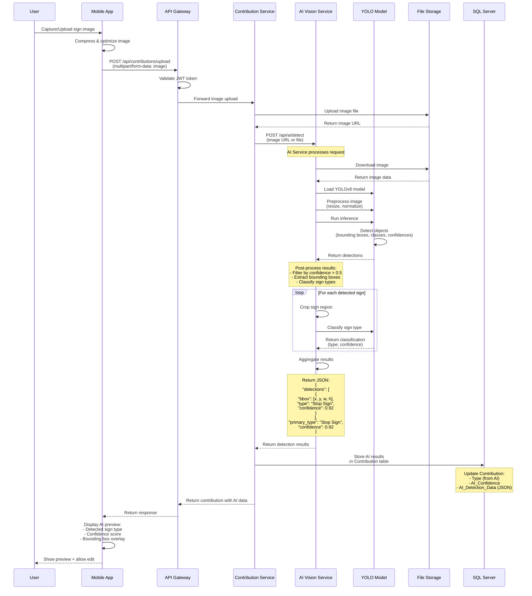
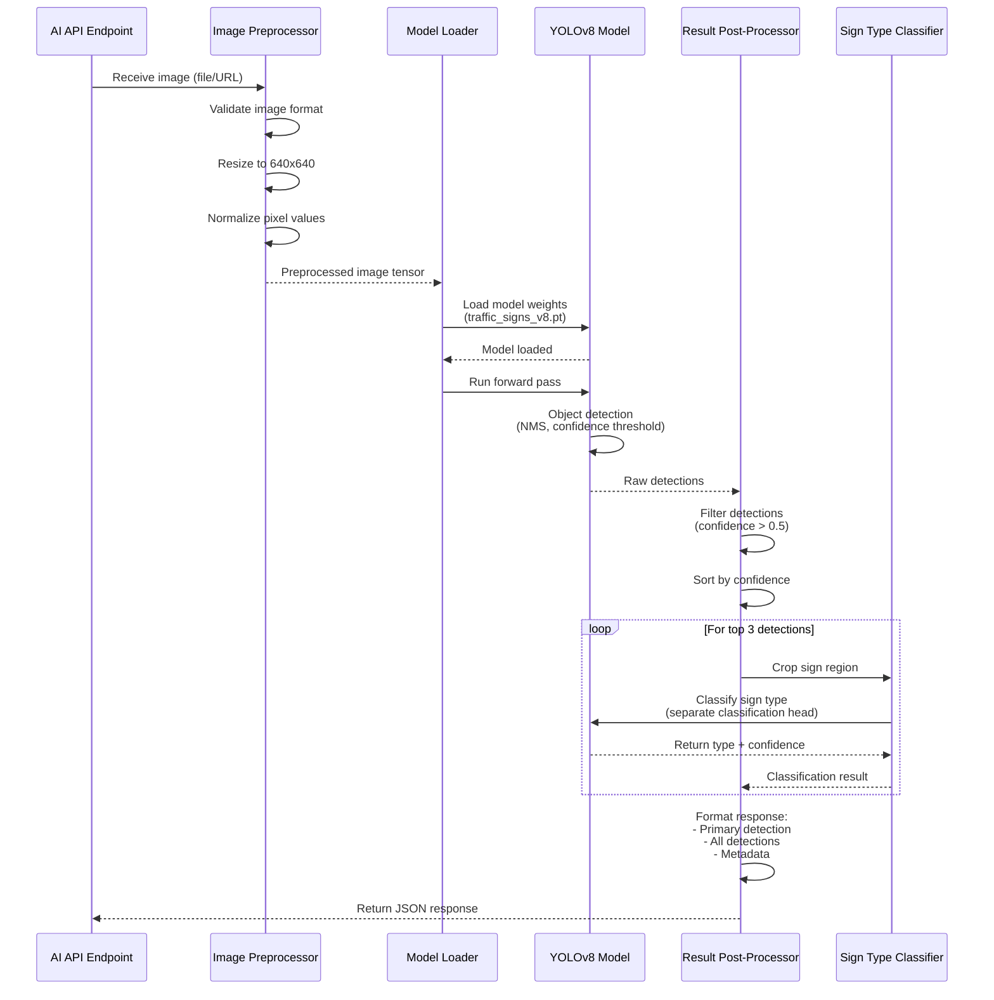

# Sequence Diagram - AI Detection Flow

## Flow: AI Vision Service detects and classifies traffic signs

```mermaid
sequenceDiagram
    participant User
    participant MobileApp as Mobile App
    participant Gateway as API Gateway
    participant ContrService as Contribution Service
    participant AIService as AI Vision Service
    participant YOLO as YOLO Model
    participant Storage as File Storage
    participant Database as SQL Server

    User->>MobileApp: Capture/Upload sign image
    MobileApp->>MobileApp: Compress & optimize image
    
    MobileApp->>Gateway: POST /api/contributions/upload<br/>(multipart/form-data: image)
    Gateway->>Gateway: Validate JWT token
    Gateway->>ContrService: Forward image upload
    
    ContrService->>Storage: Upload image file
    Storage-->>ContrService: Return image URL
    
    ContrService->>AIService: POST /api/ai/detect<br/>(image URL or file)
    Note over AIService: AI Service processes request
    
    AIService->>Storage: Download image
    Storage-->>AIService: Return image data
    
    AIService->>YOLO: Load YOLOv8 model
    AIService->>YOLO: Preprocess image<br/>(resize, normalize)
    AIService->>YOLO: Run inference
    YOLO->>YOLO: Detect objects<br/>(bounding boxes, classes, confidences)
    YOLO-->>AIService: Return detections
    
    Note over AIService: Post-process results:<br/>- Filter by confidence > 0.5<br/>- Extract bounding boxes<br/>- Classify sign types
    
    loop For each detected sign
        AIService->>AIService: Crop sign region
        AIService->>YOLO: Classify sign type
        YOLO-->>AIService: Return classification<br/>(type, confidence)
    end
    
    AIService->>AIService: Aggregate results
    Note over AIService: Return JSON:<br/>{<br/>  "detections": [<br/>    {<br/>      "bbox": [x, y, w, h],<br/>      "type": "Stop Sign",<br/>      "confidence": 0.92<br/>    }<br/>  ],<br/>  "primary_type": "Stop Sign",<br/>  "confidence": 0.92<br/>}
    
    AIService-->>ContrService: Return detection results
    
    ContrService->>Database: Store AI results<br/>in Contribution table
    Note over Database: Update Contribution:<br/>- Type (from AI)<br/>- AI_Confidence<br/>- AI_Detection_Data (JSON)
    
    ContrService-->>Gateway: Return contribution with AI data
    Gateway-->>MobileApp: Return response
    MobileApp->>MobileApp: Display AI preview:<br/>- Detected sign type<br/>- Confidence score<br/>- Bounding box overlay
    MobileApp-->>User: Show preview + allow edit
```

## Flow: AI Service internal processing

```mermaid
sequenceDiagram
    participant API as AI API Endpoint
    participant Preprocessor as Image Preprocessor
    participant ModelLoader as Model Loader
    participant YOLO as YOLOv8 Model
    participant PostProcessor as Result Post-Processor
    participant Classifier as Sign Type Classifier

    API->>Preprocessor: Receive image (file/URL)
    Preprocessor->>Preprocessor: Validate image format
    Preprocessor->>Preprocessor: Resize to 640x640
    Preprocessor->>Preprocessor: Normalize pixel values
    Preprocessor-->>ModelLoader: Preprocessed image tensor
    
    ModelLoader->>YOLO: Load model weights<br/>(traffic_signs_v8.pt)
    YOLO-->>ModelLoader: Model loaded
    
    ModelLoader->>YOLO: Run forward pass
    YOLO->>YOLO: Object detection<br/>(NMS, confidence threshold)
    YOLO-->>PostProcessor: Raw detections
    
    PostProcessor->>PostProcessor: Filter detections<br/>(confidence > 0.5)
    PostProcessor->>PostProcessor: Sort by confidence
    
    loop For top 3 detections
        PostProcessor->>Classifier: Crop sign region
        Classifier->>YOLO: Classify sign type<br/>(separate classification head)
        YOLO-->>Classifier: Return type + confidence
        Classifier-->>PostProcessor: Classification result
    end
    
    PostProcessor->>PostProcessor: Format response:<br/>- Primary detection<br/>- All detections<br/>- Metadata
    PostProcessor-->>API: Return JSON response
```

