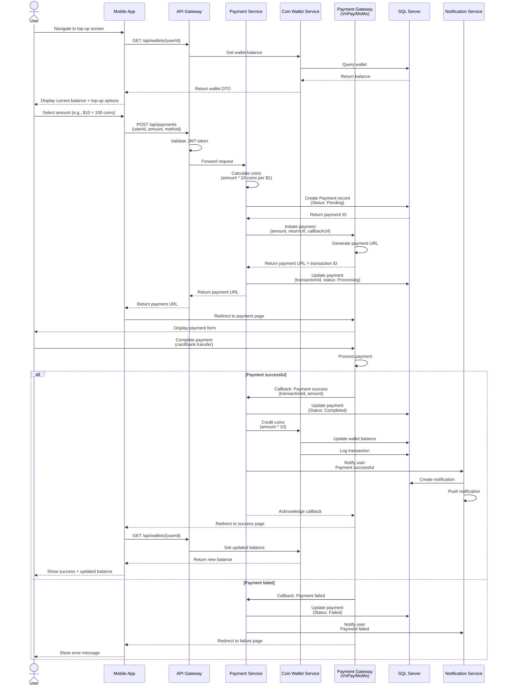
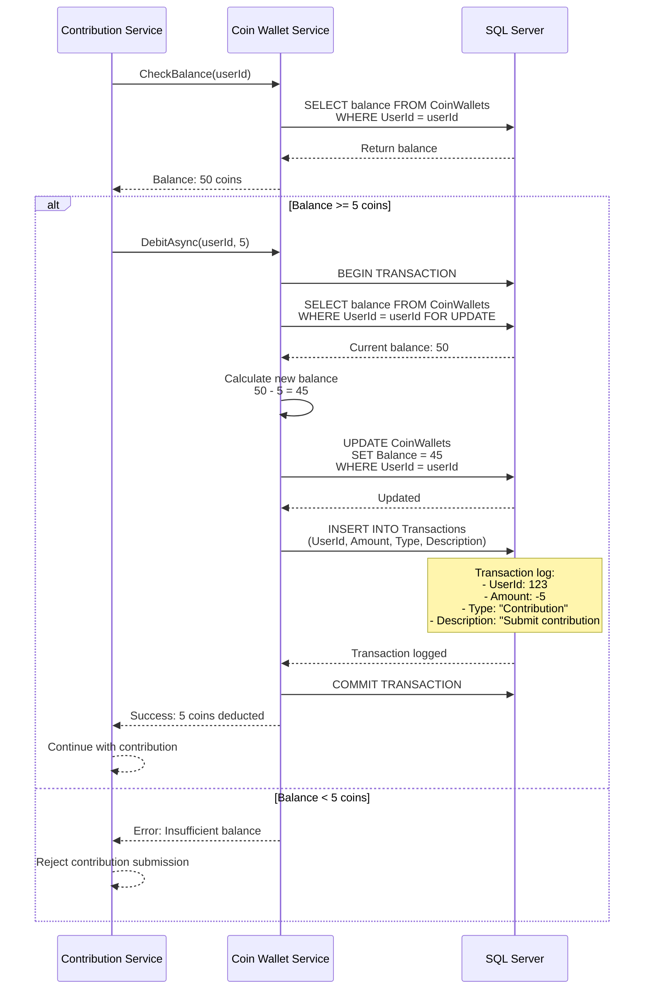

# Sequence Diagram - Payment & Coin Top-up Flow

## Flow: User tops up coins via payment gateway

```mermaid
sequenceDiagram
    actor User
    participant MobileApp as Mobile App
    participant Gateway as API Gateway
    participant PaymentService as Payment Service
    participant WalletService as Coin Wallet Service
    participant PaymentGateway as Payment Gateway<br/>(VnPay/MoMo)
    participant Database as SQL Server
    participant NotificationService as Notification Service

    User->>MobileApp: Navigate to top-up screen
    MobileApp->>Gateway: GET /api/wallets/{userId}
    Gateway->>WalletService: Get wallet balance
    WalletService->>Database: Query wallet
    Database-->>WalletService: Return balance
    WalletService-->>MobileApp: Return wallet DTO
    MobileApp-->>User: Display current balance + top-up options

    User->>MobileApp: Select amount (e.g., $10 = 100 coins)
    MobileApp->>Gateway: POST /api/payments<br/>{userId, amount, method}
    
    Gateway->>Gateway: Validate JWT token
    Gateway->>PaymentService: Forward request
    
    PaymentService->>PaymentService: Calculate coins<br/>(amount * 10 coins per $1)
    PaymentService->>Database: Create Payment record<br/>(Status: Pending)
    Database-->>PaymentService: Return payment ID
    
    PaymentService->>PaymentGateway: Initiate payment<br/>(amount, returnUrl, callbackUrl)
    PaymentGateway->>PaymentGateway: Generate payment URL
    PaymentGateway-->>PaymentService: Return payment URL + transaction ID
    
    PaymentService->>Database: Update payment<br/>(transactionId, status: Processing)
    PaymentService-->>Gateway: Return payment URL
    Gateway-->>MobileApp: Return payment URL
    MobileApp->>PaymentGateway: Redirect to payment page
    PaymentGateway-->>User: Display payment form
    
    User->>PaymentGateway: Complete payment<br/>(card/bank transfer)
    PaymentGateway->>PaymentGateway: Process payment
    
    alt Payment successful
        PaymentGateway->>PaymentService: Callback: Payment success<br/>(transactionId, amount)
        PaymentService->>Database: Update payment<br/>(Status: Completed)
        PaymentService->>WalletService: Credit coins<br/>(amount * 10)
        WalletService->>Database: Update wallet balance
        WalletService->>Database: Log transaction
        
        PaymentService->>NotificationService: Notify user<br/>Payment successful
        NotificationService->>Database: Create notification
        NotificationService->>NotificationService: Push notification
        
        PaymentService-->>PaymentGateway: Acknowledge callback
        PaymentGateway-->>MobileApp: Redirect to success page
        MobileApp->>Gateway: GET /api/wallets/{userId}
        Gateway->>WalletService: Get updated balance
        WalletService-->>MobileApp: Return new balance
        MobileApp-->>User: Show success + updated balance
        
    else Payment failed
        PaymentGateway->>PaymentService: Callback: Payment failed
        PaymentService->>Database: Update payment<br/>(Status: Failed)
        PaymentService->>NotificationService: Notify user<br/>Payment failed
        PaymentGateway-->>MobileApp: Redirect to failure page
        MobileApp-->>User: Show error message
    end
```

## Flow: Coin deduction for contribution submission

```mermaid
sequenceDiagram
    participant ContrService as Contribution Service
    participant WalletService as Coin Wallet Service
    participant Database as SQL Server

    ContrService->>WalletService: CheckBalance(userId)
    WalletService->>Database: SELECT balance FROM CoinWallets<br/>WHERE UserId = userId
    Database-->>WalletService: Return balance
    WalletService-->>ContrService: Balance: 50 coins
    
    alt Balance >= 5 coins
        ContrService->>WalletService: DebitAsync(userId, 5)
        WalletService->>Database: BEGIN TRANSACTION
        WalletService->>Database: SELECT balance FROM CoinWallets<br/>WHERE UserId = userId FOR UPDATE
        Database-->>WalletService: Current balance: 50
        
        WalletService->>WalletService: Calculate new balance<br/>50 - 5 = 45
        WalletService->>Database: UPDATE CoinWallets<br/>SET Balance = 45<br/>WHERE UserId = userId
        Database-->>WalletService: Updated
        
        WalletService->>Database: INSERT INTO Transactions<br/>(UserId, Amount, Type, Description)
        Note over Database: Transaction log:<br/>- UserId: 123<br/>- Amount: -5<br/>- Type: "Contribution"<br/>- Description: "Submit contribution #456"
        Database-->>WalletService: Transaction logged
        
        WalletService->>Database: COMMIT TRANSACTION
        WalletService-->>ContrService: Success: 5 coins deducted
        ContrService-->>ContrService: Continue with contribution
        
    else Balance < 5 coins
        WalletService-->>ContrService: Error: Insufficient balance
        ContrService-->>ContrService: Reject contribution submission
    end
```

