# Deployment Diagram - SignMap

## Infrastructure và Deployment Architecture

```mermaid
graph TB
    subgraph "Internet"
        USERS[Users<br/>Mobile & Web]
    end

    subgraph "Cloud Provider - Azure/AWS"
        subgraph "Load Balancer Layer"
            LB[Application Load Balancer<br/>SSL Termination<br/>DDoS Protection]
        end

        subgraph "API Gateway Cluster"
            GW1[API Gateway Instance 1<br/>.NET 8]
            GW2[API Gateway Instance 2<br/>.NET 8]
        end

        subgraph "Microservices Cluster"
            subgraph "User Service"
                US1[User Service Instance 1]
                US2[User Service Instance 2]
            end
            
            subgraph "Traffic Sign Service"
                TS1[Traffic Sign Service Instance 1]
                TS2[Traffic Sign Service Instance 2]
            end
            
            subgraph "Contribution Service"
                CS1[Contribution Service Instance 1]
                CS2[Contribution Service Instance 2]
            end
            
            subgraph "Voting Service"
                VS1[Voting Service Instance 1]
                VS2[Voting Service Instance 2]
            end
            
            subgraph "Notification Service"
                NS1[Notification Service Instance 1<br/>+ SignalR Hub]
                NS2[Notification Service Instance 2<br/>+ SignalR Hub]
            end
            
            subgraph "Payment Service"
                PS1[Payment Service Instance 1]
                PS2[Payment Service Instance 2]
            end
        end

        subgraph "AI Service Cluster"
            AI1[AI Vision Service Instance 1<br/>Python + FastAPI<br/>GPU-enabled]
            AI2[AI Vision Service Instance 2<br/>Python + FastAPI<br/>GPU-enabled]
        end

        subgraph "Data Layer"
            subgraph "Primary Database"
                DB_PRIMARY[(SQL Server<br/>Primary<br/>Read/Write)]
            end
            
            subgraph "Replica Database"
                DB_REPLICA[(SQL Server<br/>Read Replica<br/>Read-only)]
            end
            
            subgraph "Cache Layer"
                REDIS[(Redis Cache<br/>Session & Temp Data)]
            end
        end

        subgraph "Storage"
            BLOB[Azure Blob Storage<br/>or AWS S3<br/>Images & Files]
        end

        subgraph "Background Jobs"
            BG[Background Job Service<br/>Hangfire/Quartz<br/>- Auto-approval<br/>- Scheduled tasks]
        end

        subgraph "Message Queue"
            MQ[Azure Service Bus<br/>or RabbitMQ<br/>Async Communication]
        end
    end

    subgraph "External Services"
        OSM[OpenStreetMap API]
        EMAIL[Email Service<br/>SendGrid/SMTP]
        FCM[Firebase Cloud Messaging]
        PAY[Payment Gateway<br/>VnPay/MoMo]
    end

    subgraph "Monitoring & Logging"
        MONITOR[Application Insights<br/>or CloudWatch]
        LOGS[Log Analytics<br/>Centralized Logging]
    end

    USERS -->|HTTPS| LB
    LB --> GW1
    LB --> GW2
    
    GW1 --> US1
    GW1 --> US2
    GW1 --> TS1
    GW1 --> TS2
    GW1 --> CS1
    GW1 --> CS2
    GW1 --> VS1
    GW1 --> VS2
    GW1 --> NS1
    GW1 --> NS2
    GW1 --> PS1
    GW1 --> PS2
    
    GW2 --> US1
    GW2 --> US2
    GW2 --> TS1
    GW2 --> TS2
    GW2 --> CS1
    GW2 --> CS2
    GW2 --> VS1
    GW2 --> VS2
    GW2 --> NS1
    GW2 --> NS2
    GW2 --> PS1
    GW2 --> PS2

    CS1 --> AI1
    CS2 --> AI2
    CS1 --> AI2
    CS2 --> AI1

    US1 --> DB_PRIMARY
    US2 --> DB_PRIMARY
    TS1 --> DB_PRIMARY
    TS2 --> DB_PRIMARY
    CS1 --> DB_PRIMARY
    CS2 --> DB_PRIMARY
    VS1 --> DB_PRIMARY
    VS2 --> DB_PRIMARY
    NS1 --> DB_PRIMARY
    NS2 --> DB_PRIMARY
    PS1 --> DB_PRIMARY
    PS2 --> DB_PRIMARY

    TS1 --> DB_REPLICA
    TS2 --> DB_REPLICA

    GW1 --> REDIS
    GW2 --> REDIS
    NS1 --> REDIS
    NS2 --> REDIS

    CS1 --> BLOB
    CS2 --> BLOB
    AI1 --> BLOB
    AI2 --> BLOB

    BG --> DB_PRIMARY
    BG --> MQ

    NS1 --> EMAIL
    NS2 --> EMAIL
    NS1 --> FCM
    NS2 --> FCM

    TS1 --> OSM
    TS2 --> OSM

    PS1 --> PAY
    PS2 --> PAY

    GW1 --> MONITOR
    GW2 --> MONITOR
    US1 --> LOGS
    TS1 --> LOGS
    CS1 --> LOGS
    AI1 --> LOGS

    style LB fill:#4A90E2
    style DB_PRIMARY fill:#50C878
    style AI1 fill:#FF6B6B
    style BLOB fill:#FFA500
    style REDIS fill:#DC143C
```

## Deployment Specifications

### Compute Resources
- **API Gateway:** 2-4 instances, 2 vCPU, 4GB RAM each
- **Microservices:** 2 instances each, 2 vCPU, 4GB RAM each
- **AI Service:** 2 instances, 4 vCPU, 16GB RAM, GPU-enabled (NVIDIA T4 or similar)
- **Background Jobs:** 1 instance, 2 vCPU, 4GB RAM

### Database
- **Primary:** SQL Server Standard/Enterprise, Always On Availability Groups
- **Replica:** Read-only replica for reporting and read-heavy operations
- **Backup:** Automated daily backups, 30-day retention

### Storage
- **Blob Storage:** Azure Blob Storage or AWS S3, tiered storage (Hot/Cool)
- **CDN:** CloudFront or Azure CDN for image delivery

### Networking
- **VPC/VNet:** Private network for internal services
- **Load Balancer:** Application Load Balancer with health checks
- **SSL/TLS:** Certificates managed by cloud provider

### Monitoring
- **Application Insights/CloudWatch:** Real-time metrics, alerts
- **Log Analytics:** Centralized logging, search, analysis
- **Health Checks:** Automatic failover, auto-scaling

### Scaling Strategy
- **Horizontal Scaling:** Auto-scale based on CPU/memory metrics
- **Vertical Scaling:** Upgrade instance types for AI service as needed
- **Database Scaling:** Read replicas for read-heavy workloads

