# Use Case Diagram - SignMap

## Actors và Use Cases

```mermaid
graph TB
    subgraph "Actors"
        DRIVER[Driver<br/>Mobile User]
        RESIDENT[Local Resident<br/>Mobile User]
        ADMIN[Administrator<br/>Web User]
        STAFF[Staff Member<br/>Web User]
        SYSTEM[System<br/>Background Jobs]
        AISERVICE[AI Service]
        PAYGATEWAY[Payment Gateway]
    end

    subgraph "User Management"
        UC1[Register Account]
        UC2[Login/Logout]
        UC3[View Profile]
        UC4[Update Profile]
        UC5[Manage Coin Wallet]
    end

    subgraph "Traffic Sign Management"
        UC6[View Traffic Signs on Map]
        UC7[Search Traffic Signs]
        UC8[Advanced Search with Filters]
        UC9[View Sign Details]
    end

    subgraph "Contribution Management"
        UC10[Submit New Sign Contribution]
        UC11[Submit Update Contribution]
        UC12[Submit Delete Contribution]
        UC13[Upload Sign Image]
        UC14[Preview AI Detection Results]
        UC15[View My Contributions]
        UC16[Track Contribution Status]
    end

    subgraph "Voting System"
        UC17[View Pending Contributions]
        UC18[Upvote Contribution]
        UC19[Downvote Contribution]
        UC20[View Voting History]
        UC21[Receive Vote Alignment Rewards]
    end

    subgraph "AI Features"
        UC22[Auto-detect Traffic Signs]
        UC23[Auto-classify Sign Type]
        UC24[Get Detection Confidence]
    end

    subgraph "Payment & Coins"
        UC25[Top-up Coins]
        UC26[View Transaction History]
        UC27[Deduct Coins for Contribution]
        UC28[Receive Coins for Approved Contribution]
    end

    subgraph "Notifications"
        UC29[Receive Real-time Notifications]
        UC30[View Notification List]
        UC31[Mark Notification as Read]
        UC32[Receive Email Notifications]
        UC33[Receive Push Notifications]
    end

    subgraph "Administration"
        UC34[Review Contributions]
        UC35[Approve Contribution]
        UC36[Reject Contribution]
        UC37[Override Vote Outcomes]
        UC38[Manage Users]
        UC39[View Analytics Dashboard]
        UC40[Manage Traffic Signs]
        UC41[Adjust User Coins]
        UC42[View System Reports]
    end

    subgraph "System Processes"
        UC43[Auto-approve Contributions<br/>Score > 70%]
        UC44[Auto-reject Contributions<br/>Score < 30%]
        UC45[Flag for Admin Review<br/>Score 30-70%]
        UC46[Calculate Weighted Votes]
        UC47[Update User Reputation]
        UC48[Process Payments]
        UC49[Send Notifications]
        UC50[Generate Change Reports<br/>Hungarian Algorithm]
    end

    %% Driver/Resident Use Cases
    DRIVER --> UC1
    DRIVER --> UC2
    DRIVER --> UC3
    DRIVER --> UC4
    DRIVER --> UC5
    DRIVER --> UC6
    DRIVER --> UC7
    DRIVER --> UC8
    DRIVER --> UC9
    DRIVER --> UC10
    DRIVER --> UC11
    DRIVER --> UC12
    DRIVER --> UC13
    DRIVER --> UC14
    DRIVER --> UC15
    DRIVER --> UC16
    DRIVER --> UC17
    DRIVER --> UC18
    DRIVER --> UC19
    DRIVER --> UC20
    DRIVER --> UC21
    DRIVER --> UC25
    DRIVER --> UC26
    DRIVER --> UC29
    DRIVER --> UC30
    DRIVER --> UC31

    RESIDENT --> UC1
    RESIDENT --> UC2
    RESIDENT --> UC3
    RESIDENT --> UC4
    RESIDENT --> UC5
    RESIDENT --> UC6
    RESIDENT --> UC7
    RESIDENT --> UC8
    RESIDENT --> UC10
    RESIDENT --> UC11
    RESIDENT --> UC12
    RESIDENT --> UC13
    RESIDENT --> UC14
    RESIDENT --> UC15
    RESIDENT --> UC16
    RESIDENT --> UC17
    RESIDENT --> UC18
    RESIDENT --> UC19
    RESIDENT --> UC20
    RESIDENT --> UC21
    RESIDENT --> UC25
    RESIDENT --> UC26
    RESIDENT --> UC29
    RESIDENT --> UC30
    RESIDENT --> UC31

    %% Admin Use Cases
    ADMIN --> UC2
    ADMIN --> UC3
    ADMIN --> UC34
    ADMIN --> UC35
    ADMIN --> UC36
    ADMIN --> UC37
    ADMIN --> UC38
    ADMIN --> UC39
    ADMIN --> UC40
    ADMIN --> UC41
    ADMIN --> UC42
    ADMIN --> UC6
    ADMIN --> UC7

    %% Staff Use Cases
    STAFF --> UC2
    STAFF --> UC3
    STAFF --> UC34
    STAFF --> UC35
    STAFF --> UC36
    STAFF --> UC6
    STAFF --> UC7
    STAFF --> UC39

    %% System Use Cases
    SYSTEM --> UC43
    SYSTEM --> UC44
    SYSTEM --> UC45
    SYSTEM --> UC46
    SYSTEM --> UC47
    SYSTEM --> UC49
    SYSTEM --> UC50

    %% AI Service Use Cases
    AISERVICE --> UC22
    AISERVICE --> UC23
    AISERVICE --> UC24

    %% Payment Gateway Use Cases
    PAYGATEWAY --> UC48

    %% Relationships
    UC13 --> UC22
    UC22 --> UC23
    UC23 --> UC24
    UC14 --> UC24
    UC10 --> UC22
    UC10 --> UC27
    UC35 --> UC28
    UC35 --> UC47
    UC18 --> UC46
    UC19 --> UC46
    UC46 --> UC43
    UC46 --> UC44
    UC46 --> UC45
    UC25 --> UC48
    UC48 --> UC49
    UC35 --> UC49
    UC36 --> UC49

    style DRIVER fill:#E3F2FD
    style RESIDENT fill:#E3F2FD
    style ADMIN fill:#FFEBEE
    style STAFF fill:#FFF3E0
    style SYSTEM fill:#F3E5F5
    style AISERVICE fill:#FF6B6B
    style PAYGATEWAY fill:#4CAF50
```

## Use Case Descriptions

### User Management
- **Register Account:** New user creates account with email/username
- **Login/Logout:** Authentication using JWT tokens
- **View/Update Profile:** Manage user information
- **Manage Coin Wallet:** View balance, transaction history

### Traffic Sign Management
- **View on Map:** Display signs on OpenStreetMap interface
- **Search:** Basic search (free) or advanced search (1 coin)
- **View Details:** Full information about a traffic sign

### Contribution Management
- **Submit Contributions:** Add/Update/Delete traffic signs (costs 5 coins)
- **Upload Image:** Attach photo with GPS location
- **AI Preview:** See AI detection results before submission
- **Track Status:** Monitor contribution approval/rejection

### Voting System
- **Vote on Contributions:** Upvote/downvote with weighted algorithm
- **View History:** See all votes cast
- **Receive Rewards:** Get coins when votes align with final decision

### AI Features
- **Auto-detect:** YOLO detects signs in uploaded images
- **Auto-classify:** Identifies sign type automatically
- **Confidence Score:** Shows detection confidence

### Payment & Coins
- **Top-up:** Purchase coins via payment gateway
- **Transaction History:** View all coin transactions
- **Earn Coins:** Receive coins for approved contributions

### Administration
- **Review Contributions:** Manual review of flagged contributions
- **Override Votes:** Admin can override automatic decisions
- **Analytics:** View system statistics and reports
- **User Management:** Manage users, adjust coins, etc.

### System Processes
- **Auto-approval/Rejection:** Based on weighted voting scores
- **Reputation Updates:** Automatically update user reputation
- **Change Detection:** Hungarian algorithm for detecting modifications

