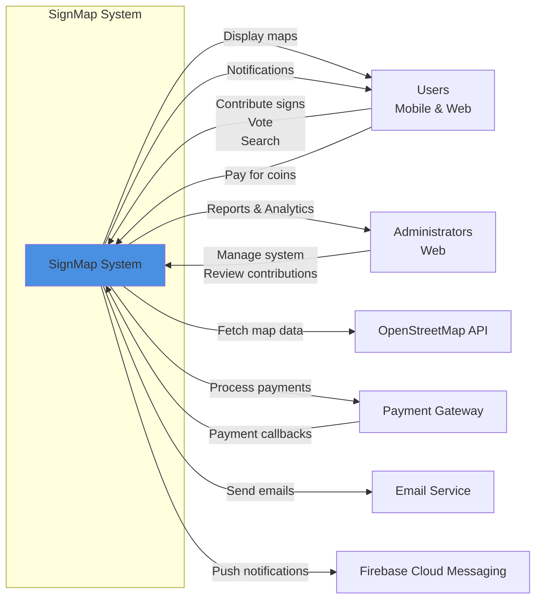
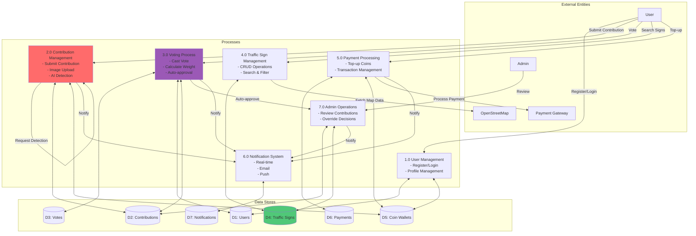
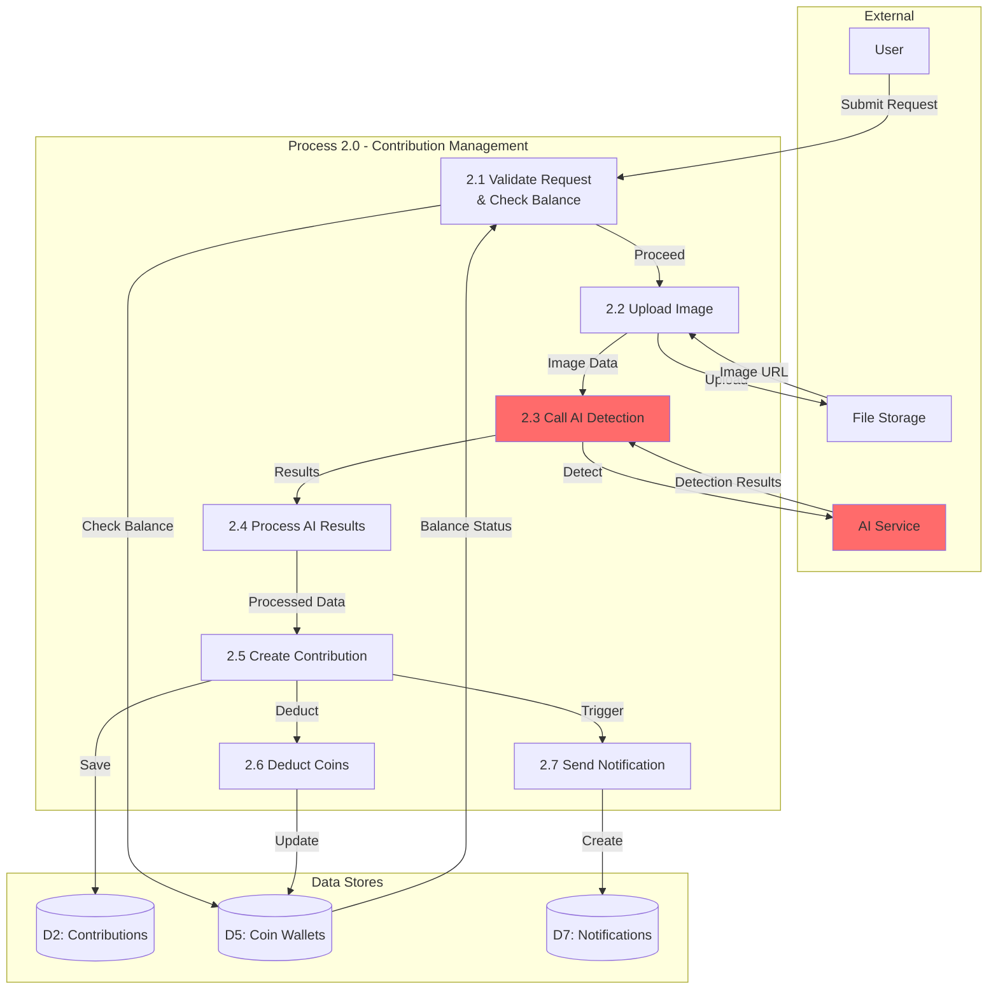
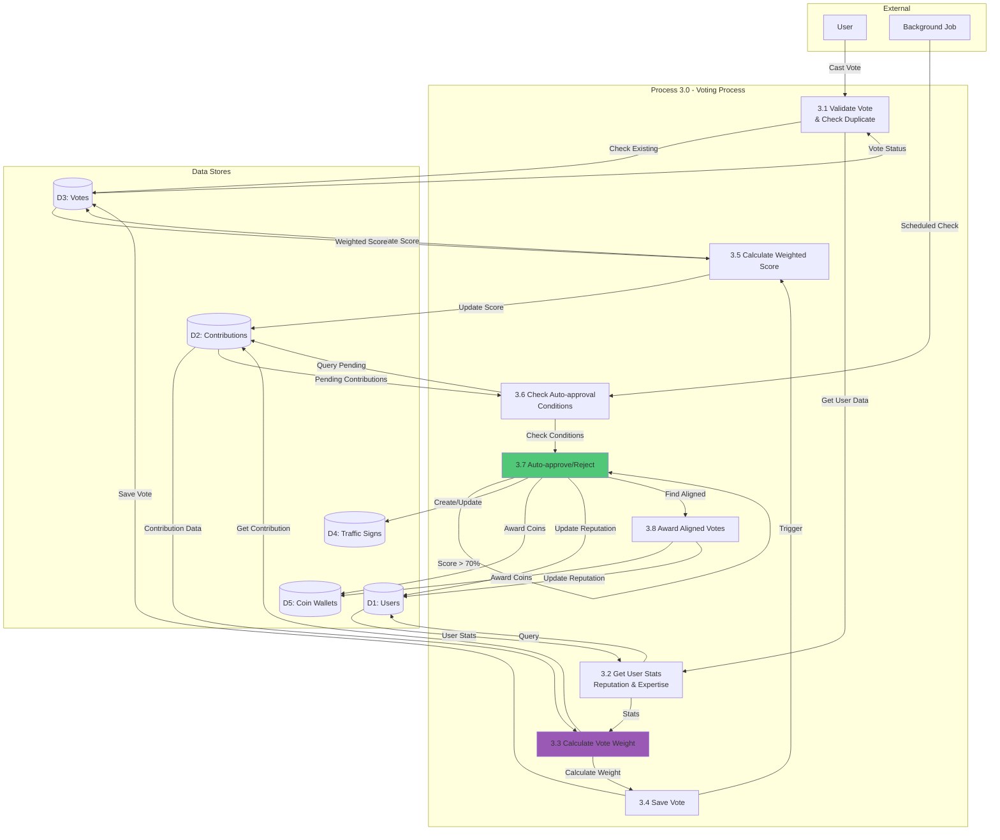

# Data Flow Diagram - SignMap

## Level 0 - Context Diagram

```mermaid
graph LR
    subgraph "SignMap System"
        SYSTEM[SignMap System]
    end

    USER[Users<br/>Mobile & Web]
    ADMIN[Administrators<br/>Web]
    OSM[OpenStreetMap API]
    PAY[Payment Gateway]
    EMAIL[Email Service]
    FCM[Firebase Cloud Messaging]

    USER -->|Contribute signs<br/>Vote<br/>Search| SYSTEM
    USER -->|Pay for coins| SYSTEM
    SYSTEM -->|Display maps| USER
    SYSTEM -->|Notifications| USER

    ADMIN -->|Manage system<br/>Review contributions| SYSTEM
    SYSTEM -->|Reports & Analytics| ADMIN

    SYSTEM -->|Fetch map data| OSM
    SYSTEM -->|Process payments| PAY
    PAY -->|Payment callbacks| SYSTEM

    SYSTEM -->|Send emails| EMAIL
    SYSTEM -->|Push notifications| FCM

    style SYSTEM fill:#4A90E2
```

## Level 1 - Main Processes

```mermaid
graph TB
    subgraph "External Entities"
        USER[User]
        ADMIN[Admin]
        OSM[OpenStreetMap]
        PAY[Payment Gateway]
    end

    subgraph "Processes"
        P1[1.0 User Management<br/>- Register/Login<br/>- Profile Management]
        P2[2.0 Contribution Management<br/>- Submit Contribution<br/>- Image Upload<br/>- AI Detection]
        P3[3.0 Voting Process<br/>- Cast Vote<br/>- Calculate Weight<br/>- Auto-approval]
        P4[4.0 Traffic Sign Management<br/>- CRUD Operations<br/>- Search & Filter]
        P5[5.0 Payment Processing<br/>- Top-up Coins<br/>- Transaction Management]
        P6[6.0 Notification System<br/>- Real-time<br/>- Email<br/>- Push]
        P7[7.0 Admin Operations<br/>- Review Contributions<br/>- Override Decisions]
    end

    subgraph "Data Stores"
        D1[(D1: Users)]
        D2[(D2: Contributions)]
        D3[(D3: Votes)]
        D4[(D4: Traffic Signs)]
        D5[(D5: Coin Wallets)]
        D6[(D6: Payments)]
        D7[(D7: Notifications)]
    end

    USER -->|Register/Login| P1
    P1 <--> D1
    P1 <--> D5

    USER -->|Submit Contribution| P2
    P2 -->|Upload Image| P2
    P2 <--> D2
    P2 <--> D5
    P2 -->|Request Detection| P2

    USER -->|Vote| P3
    P3 <--> D3
    P3 <--> D1
    P3 <--> D2
    P3 -->|Auto-approve| P7

    USER -->|Search Signs| P4
    P4 <--> D4
    P4 -->|Fetch Map Data| OSM

    USER -->|Top-up| P5
    P5 <--> D6
    P5 <--> D5
    P5 -->|Process Payment| PAY

    P2 -->|Notify| P6
    P3 -->|Notify| P6
    P5 -->|Notify| P6
    P6 <--> D7

    ADMIN -->|Review| P7
    P7 <--> D2
    P7 <--> D4
    P7 -->|Notify| P6

    style P2 fill:#FF6B6B
    style P3 fill:#9B59B6
    style D4 fill:#50C878
```

## Level 2 - Contribution Process Detail

```mermaid
graph TB
    subgraph "External"
        USER[User]
        AI[AI Service]
        STORAGE[File Storage]
    end

    subgraph "Process 2.0 - Contribution Management"
        P2_1[2.1 Validate Request<br/>& Check Balance]
        P2_2[2.2 Upload Image]
        P2_3[2.3 Call AI Detection]
        P2_4[2.4 Process AI Results]
        P2_5[2.5 Create Contribution]
        P2_6[2.6 Deduct Coins]
        P2_7[2.7 Send Notification]
    end

    subgraph "Data Stores"
        D2[(D2: Contributions)]
        D5[(D5: Coin Wallets)]
        D7[(D7: Notifications)]
    end

    USER -->|Submit Request| P2_1
    P2_1 -->|Check Balance| D5
    D5 -->|Balance Status| P2_1

    P2_1 -->|Proceed| P2_2
    P2_2 -->|Upload| STORAGE
    STORAGE -->|Image URL| P2_2

    P2_2 -->|Image Data| P2_3
    P2_3 -->|Detect| AI
    AI -->|Detection Results| P2_3

    P2_3 -->|Results| P2_4
    P2_4 -->|Processed Data| P2_5

    P2_5 -->|Save| D2
    P2_5 -->|Deduct| P2_6
    P2_6 -->|Update| D5

    P2_5 -->|Trigger| P2_7
    P2_7 -->|Create| D7

    style P2_3 fill:#FF6B6B
    style AI fill:#FF6B6B
```

## Level 2 - Voting Process Detail

```mermaid
graph TB
    subgraph "External"
        USER[User]
        SYSTEM[Background Job]
    end

    subgraph "Process 3.0 - Voting Process"
        P3_1[3.1 Validate Vote<br/>& Check Duplicate]
        P3_2[3.2 Get User Stats<br/>Reputation & Expertise]
        P3_3[3.3 Calculate Vote Weight]
        P3_4[3.4 Save Vote]
        P3_5[3.5 Calculate Weighted Score]
        P3_6[3.6 Check Auto-approval<br/>Conditions]
        P3_7[3.7 Auto-approve/Reject]
        P3_8[3.8 Award Aligned Votes]
    end

    subgraph "Data Stores"
        D1[(D1: Users)]
        D2[(D2: Contributions)]
        D3[(D3: Votes)]
        D4[(D4: Traffic Signs)]
        D5[(D5: Coin Wallets)]
    end

    USER -->|Cast Vote| P3_1
    P3_1 -->|Check Existing| D3
    D3 -->|Vote Status| P3_1

    P3_1 -->|Get User Data| P3_2
    P3_2 -->|Query| D1
    D1 -->|User Stats| P3_2

    P3_2 -->|Stats| P3_3
    P3_3 -->|Get Contribution| D2
    D2 -->|Contribution Data| P3_3
    P3_3 -->|Calculate Weight| P3_4

    P3_4 -->|Save Vote| D3
    P3_4 -->|Trigger| P3_5

    P3_5 -->|Calculate Score| D3
    D3 -->|Weighted Score| P3_5
    P3_5 -->|Update Score| D2

    SYSTEM -->|Scheduled Check| P3_6
    P3_6 -->|Query Pending| D2
    D2 -->|Pending Contributions| P3_6

    P3_6 -->|Check Conditions| P3_7
    P3_7 -->|Score > 70%| P3_7
    P3_7 -->|Create/Update| D4
    P3_7 -->|Award Coins| D5
    P3_7 -->|Update Reputation| D1

    P3_7 -->|Find Aligned| P3_8
    P3_8 -->|Award Coins| D5
    P3_8 -->|Update Reputation| D1

    style P3_3 fill:#9B59B6
    style P3_7 fill:#50C878
```

