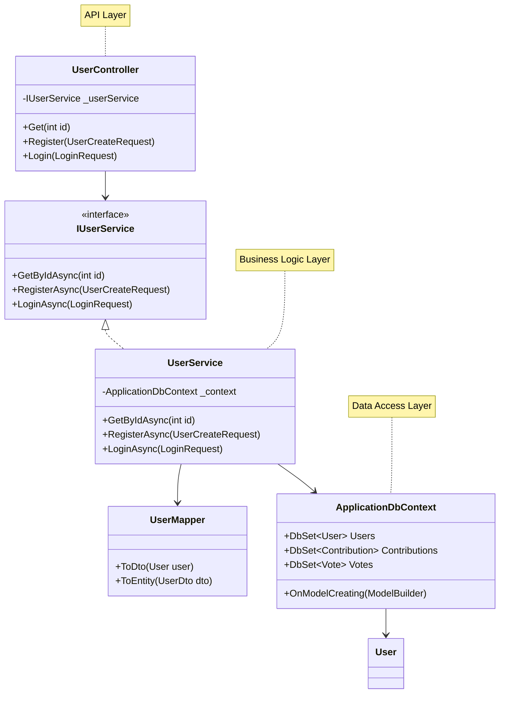

# Class Diagram - SignMap Backend

## Core Domain Models và Relationships

```mermaid
classDiagram
    class User {
        +int Id
        +string Username
        +string Email
        +string Password
        +string Firstname
        +string Lastname
        +int RoleId
        +string PhoneNumber
        +float Reputation
        +DateTime CreatedAt
        +DateTime UpdatedAt
        +CoinWallet Wallet
        +List~Contribution~ Contributions
        +List~Vote~ Votes
        +List~Notification~ Notifications
        +List~Feedback~ Feedbacks
        +List~Payment~ Payments
    }

    class CoinWallet {
        +int Id
        +int UserId
        +decimal Balance
        +DateTime CreatedAt
        +DateTime UpdatedAt
        +User User
        +CheckBalance()
        +Credit(decimal amount)
        +Debit(decimal amount)
    }

    class TrafficSign {
        +int Id
        +string Type
        +Point Location
        +string Status
        +string ImageUrl
        +DateTime ValidFrom
        +DateTime ValidTo
        +List~string~ Traffic
        +List~Contribution~ Contributions
        +GetLatitude()
        +GetLongitude()
    }

    class Contribution {
        +int Id
        +int UserId
        +int SignId
        +int TrafficSignId
        +string Action
        +string Description
        +string Status
        +string ImageUrl
        +string Type
        +double? Latitude
        +double? Longitude
        +DateTime CreatedAt
        +User User
        +TrafficSign TrafficSign
        +List~Vote~ Votes
        +CalculateWeightedScore()
        +CheckAutoApproval()
    }

    class Vote {
        +int Id
        +int UserId
        +int ContributionId
        +int Value
        +bool IsUpvote
        +float Weight
        +DateTime CreatedAt
        +User User
        +Contribution Contribution
        +CalculateWeight()
    }

    class Notification {
        +int Id
        +int UserId
        +string Title
        +string Message
        +bool IsRead
        +DateTime CreatedAt
        +DateTime UpdatedAt
        +User User
        +MarkAsRead()
    }

    class Feedback {
        +int Id
        +int UserId
        +string Content
        +string Status
        +DateTime CreatedAt
        +DateTime? ResolvedAt
        +User User
        +Resolve()
    }

    class Payment {
        +int Id
        +int UserId
        +decimal Amount
        +DateTime PaymentDate
        +string PaymentMethod
        +string Status
        +User User
        +Process()
        +Complete()
        +Fail()
    }

    class UserService {
        -ApplicationDbContext _context
        +GetByIdAsync(int id)
        +RegisterAsync(UserCreateRequest request)
        +LoginAsync(LoginRequest request)
        +UpdateReputationAsync(int userId, float points)
        +CalculateExpertiseAsync(int userId)
    }

    class ContributionService {
        -ApplicationDbContext _context
        -ICoinWalletService _coinWalletService
        -ITrafficSignService _trafficSignService
        -INotificationService _notificationService
        +SubmitAsync(ContributionCreateRequest request)
        +ApproveAsync(int id, ContributionReviewRequest request)
        +RejectAsync(int id, ContributionReviewRequest request)
        +CheckAutoApprovalAsync(int contributionId)
    }

    class VoteService {
        -ApplicationDbContext _context
        -IUserService _userService
        +CreateAsync(VoteCreateRequest request)
        +CalculateWeightAsync(int userId, int contributionId)
        +CalculateWeightedScoreAsync(int contributionId)
        +GetAlignedVotesAsync(int contributionId, bool isApproved)
    }

    class AIVisionService {
        -YOLOModel _model
        +DetectSignsAsync(byte[] imageData)
        +ClassifySignAsync(byte[] imageData)
        +GetConfidenceAsync(string imageUrl)
    }

    class CoinWalletService {
        -ApplicationDbContext _context
        +GetBalanceAsync(int userId)
        +CreditAsync(int userId, decimal amount)
        +DebitAsync(int userId, decimal amount)
        +HasEnoughBalanceAsync(int userId, decimal amount)
    }

    class NotificationService {
        -ApplicationDbContext _context
        -SignalRHub _hub
        -IEmailService _emailService
        +CreateAsync(NotificationCreateRequest request)
        +SendRealTimeAsync(int userId, string message)
        +SendEmailAsync(int userId, string subject, string body)
        +SendPushAsync(int userId, string title, string body)
    }

    class PaymentService {
        -ApplicationDbContext _context
        -ICoinWalletService _coinWalletService
        -IPaymentGateway _paymentGateway
        +CreateAsync(PaymentCreateRequest request)
        +ProcessPaymentAsync(int paymentId)
        +HandleCallbackAsync(string transactionId, string status)
    }

    User ||--o| CoinWallet : "has one"
    User ||--o{ Contribution : "creates"
    User ||--o{ Vote : "casts"
    User ||--o{ Notification : "receives"
    User ||--o{ Feedback : "submits"
    User ||--o{ Payment : "makes"

    TrafficSign ||--o{ Contribution : "has"
    Contribution ||--o{ Vote : "receives"

    UserService --> User : "manages"
    ContributionService --> Contribution : "manages"
    ContributionService --> CoinWalletService : "uses"
    ContributionService --> TrafficSign : "creates"
    VoteService --> Vote : "manages"
    VoteService --> UserService : "uses"
    AIVisionService --> Contribution : "processes"
    CoinWalletService --> CoinWallet : "manages"
    NotificationService --> Notification : "creates"
    PaymentService --> Payment : "manages"
    PaymentService --> CoinWalletService : "uses"
```

## Service Layer Pattern



