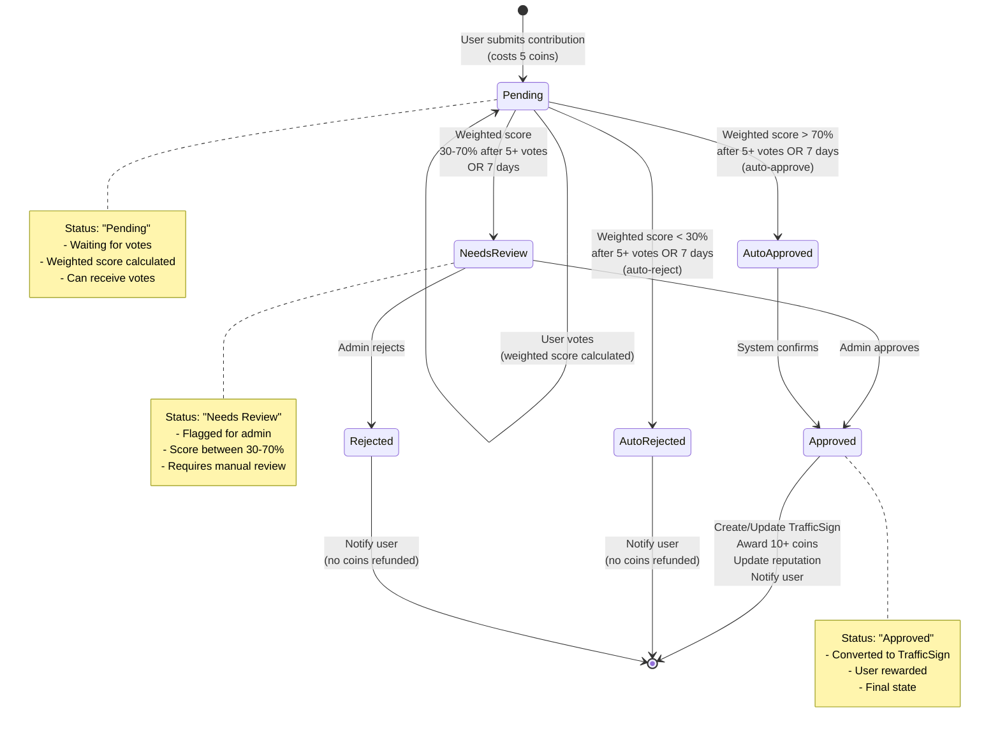
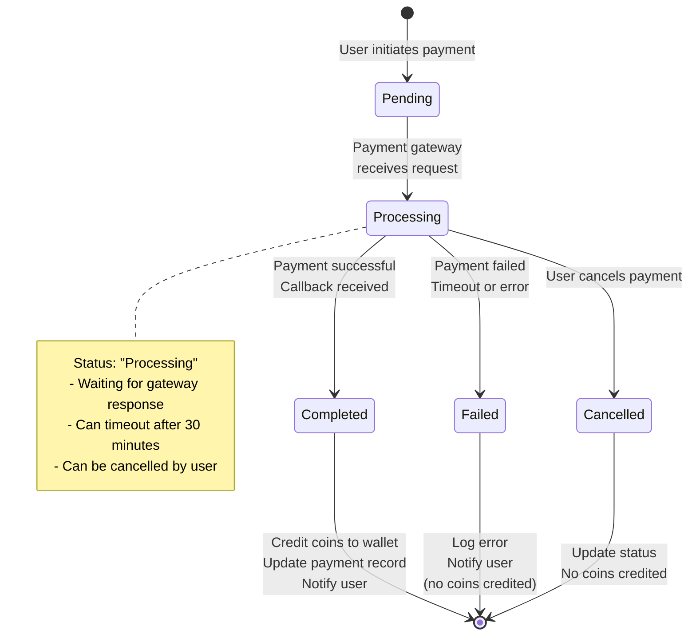
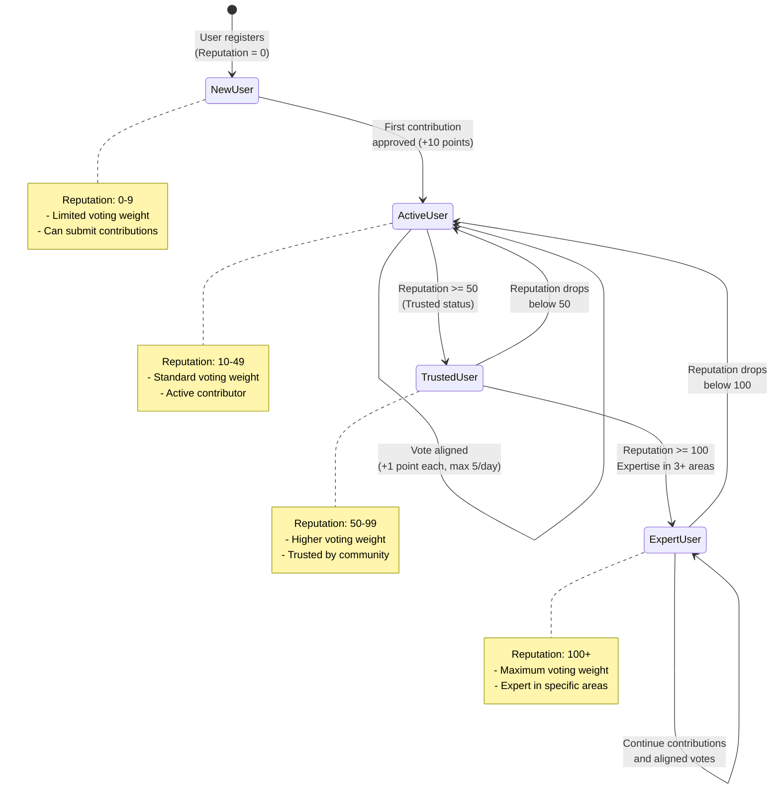
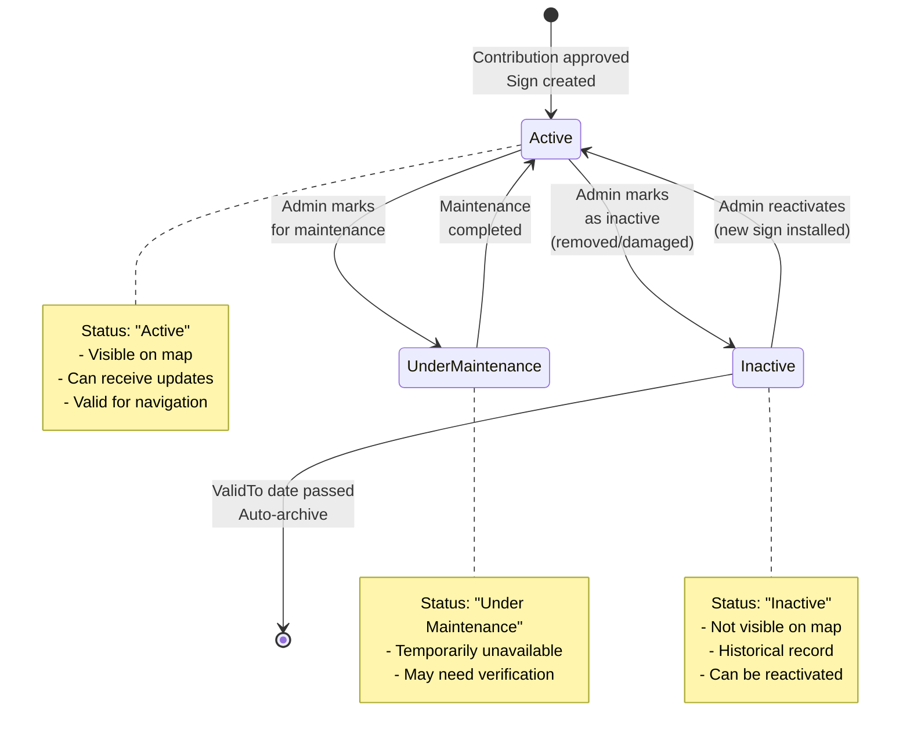

# State Diagram - SignMap

## Contribution State Machine

```mermaid
stateDiagram-v2
    [*] --> Pending: User submits contribution<br/>(costs 5 coins)
    
    Pending --> Pending: User votes<br/>(weighted score calculated)
    
    Pending --> NeedsReview: Weighted score<br/>30-70% after 5+ votes<br/>OR 7 days
    
    Pending --> AutoApproved: Weighted score > 70%<br/>after 5+ votes OR 7 days<br/>(auto-approve)
    
    Pending --> AutoRejected: Weighted score < 30%<br/>after 5+ votes OR 7 days<br/>(auto-reject)
    
    NeedsReview --> Approved: Admin approves
    NeedsReview --> Rejected: Admin rejects
    
    AutoApproved --> Approved: System confirms
    
    Approved --> [*]: Create/Update TrafficSign<br/>Award 10+ coins<br/>Update reputation<br/>Notify user
    
    AutoRejected --> [*]: Notify user<br/>(no coins refunded)
    
    Rejected --> [*]: Notify user<br/>(no coins refunded)
    
    note right of Pending
        Status: "Pending"
        - Waiting for votes
        - Weighted score calculated
        - Can receive votes
    end note
    
    note right of NeedsReview
        Status: "Needs Review"
        - Flagged for admin
        - Score between 30-70%
        - Requires manual review
    end note
    
    note right of Approved
        Status: "Approved"
        - Converted to TrafficSign
        - User rewarded
        - Final state
    end note
```

## Payment State Machine

```mermaid
stateDiagram-v2
    [*] --> Pending: User initiates payment
    
    Pending --> Processing: Payment gateway<br/>receives request
    
    Processing --> Completed: Payment successful<br/>Callback received
    
    Processing --> Failed: Payment failed<br/>Timeout or error
    
    Processing --> Cancelled: User cancels payment
    
    Completed --> [*]: Credit coins to wallet<br/>Update payment record<br/>Notify user
    
    Failed --> [*]: Log error<br/>Notify user<br/>(no coins credited)
    
    Cancelled --> [*]: Update status<br/>No coins credited
    
    note right of Processing
        Status: "Processing"
        - Waiting for gateway response
        - Can timeout after 30 minutes
        - Can be cancelled by user
    end note
```

## User Reputation State

```mermaid
stateDiagram-v2
    [*] --> NewUser: User registers<br/>(Reputation = 0)
    
    NewUser --> ActiveUser: First contribution<br/>approved (+10 points)
    
    ActiveUser --> ActiveUser: Contribution approved<br/>(+10 points each)
    
    ActiveUser --> ActiveUser: Vote aligned<br/>(+1 point each, max 5/day)
    
    ActiveUser --> TrustedUser: Reputation >= 50<br/>(Trusted status)
    
    TrustedUser --> ExpertUser: Reputation >= 100<br/>Expertise in 3+ areas
    
    ExpertUser --> ExpertUser: Continue contributions<br/>and aligned votes
    
    ExpertUser --> ActiveUser: Reputation drops<br/>below 100
    
    TrustedUser --> ActiveUser: Reputation drops<br/>below 50
    
    note right of NewUser
        Reputation: 0-9
        - Limited voting weight
        - Can submit contributions
    end note
    
    note right of ActiveUser
        Reputation: 10-49
        - Standard voting weight
        - Active contributor
    end note
    
    note right of TrustedUser
        Reputation: 50-99
        - Higher voting weight
        - Trusted by community
    end note
    
    note right of ExpertUser
        Reputation: 100+
        - Maximum voting weight
        - Expert in specific areas
    end note
```

## Traffic Sign Status State

```mermaid
stateDiagram-v2
    [*] --> Active: Contribution approved<br/>Sign created
    
    Active --> UnderMaintenance: Admin marks<br/>for maintenance
    
    UnderMaintenance --> Active: Maintenance<br/>completed
    
    Active --> Inactive: Admin marks<br/>as inactive<br/>(removed/damaged)
    
    Inactive --> Active: Admin reactivates<br/>(new sign installed)
    
    Inactive --> [*]: ValidTo date passed<br/>Auto-archive
    
    note right of Active
        Status: "Active"
        - Visible on map
        - Can receive updates
        - Valid for navigation
    end note
    
    note right of UnderMaintenance
        Status: "Under Maintenance"
        - Temporarily unavailable
        - May need verification
    end note
    
    note right of Inactive
        Status: "Inactive"
        - Not visible on map
        - Historical record
        - Can be reactivated
    end note
```

